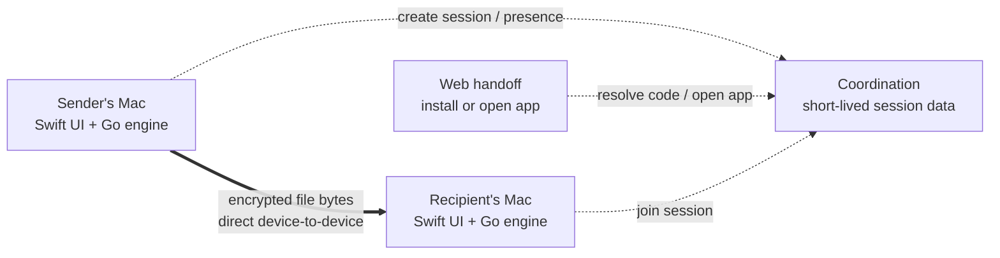

# LinkaBoo


**A Mac-first experiment in making private, peer-to-peer file transfer feel as natural as handing something to the person beside you.**

LinkaBoo is a native macOS menu bar app for direct, encrypted, app-to-app file transfer. A sender drops in a file, LinkaBoo copies a one-time handoff link, and the recipient opens that link in the native app. The backend coordinates the introduction; it never becomes a file host.

This repository is both a working MVP and a product case study: it documents the decisions behind the interaction model, character-led visual system, direct-only architecture, and current engineering work.

> **Project status:** active MVP prototype. The native sender/receiver loop, deep-link handoff, transfer progress, history, settings, and branded states are implemented. Reliability and edge-case QA are still in progress.

## At a glance

| | |
| --- | --- |
| **Platform** | macOS 12+ |
| **Product shape** | Native menu bar app + Finder extension + web install/open handoff |
| **Transfer model** | App-to-app product experience with a direct, encrypted P2P data path |
| **Infrastructure stance** | Coordination only; no payload storage and no hidden relay in the MVP |
| **Core technologies** | Swift, AppKit, SwiftUI, Go, Magic Wormhole protocol, XcodeGen |
| **Long-term direction** | Trusted contacts, automatic device-to-device delivery, and opt-in folder sharing/sync |
| **My focus** | Product direction, concept, brand identity, illustration, UX/UI, prototyping, and product documentation |
| **Collaborator** | [Aaron Price](https://github.com/aaronprice00) — engineering partnership across the Go transfer layer and native macOS implementation |

## Why I started building LinkaBoo

LinkaBoo came from a small frustration I kept running into: I wanted to give someone a file, but first I had to put that file somewhere else.

The familiar flow was to open a cloud drive or transfer service, choose the file, wait for it to upload, create a share link, check its permissions, send the link, and leave another hosted copy behind. That workflow makes sense for files that need to remain available asynchronously. It felt unnecessarily indirect for a live exchange where both people were already present.

What should have felt like **“send this file to that person”** had become **“upload this file to a third party so that person can download it again.”** The extra copy creates waiting, permission questions, cleanup, storage, and another service that has to sit between the sender and recipient.

LinkaBoo started with a narrower question:

> What if sharing a file on a Mac felt immediate and personal, while the product stayed out of the path of the file itself?

The goal is not to replace cloud storage. It is to create a better tool for the moment when storage is not the job: both people are available, the sender still has the original, and the file only needs to travel from one device to another.

That question led to three product constraints that shaped everything else:

1. **Keep the sender flow short.** Drag a file onto Boo, get a link, share it.
2. **Make the transfer model honest.** Both native apps participate in a live transfer; the browser is a handoff, not a disguised download client.
3. **Protect privacy and the business model together.** If LinkaBoo never stores or relays payload bytes, infrastructure remains small and users keep control of their data.

## P2P and app-to-app are not the same thing

LinkaBoo uses both terms because they describe different parts of the product.

| | **What it describes** | **What it means in LinkaBoo** |
| --- | --- | --- |
| **Peer-to-peer (P2P)** | The network path used by the file data | After coordination, the sender and receiver attempt a direct encrypted connection. File bytes move between their devices instead of being uploaded to LinkaBoo storage. |
| **App-to-app** | The product boundary at each endpoint | Both participants use the native LinkaBoo app. The browser link opens the app or explains how to install it; the browser is not a download client in the MVP. |

P2P answers **“where do the bytes travel?”** App-to-app answers **“what software participates?”** A product can be app-to-app while still relaying every byte through its own servers, and a browser can participate in some forms of P2P. LinkaBoo deliberately combines a native app at both ends with a direct device-to-device data path.

Requiring the native app is a product decision, not a technical accident. It gives LinkaBoo a reliable place to work with local files and folders, maintain a live transfer, integrate with Finder and the menu bar, show system-level progress, and attempt the direct TCP connection used by the current engine. The web page can stay small and honest: it coordinates the handoff, but it does not pretend that a file has been uploaded and is waiting there.

## Beyond the MVP

The current MVP is intentionally focused on proving the smallest complete behavior: one person chooses a file, another person joins the live session, and the two native apps complete a direct transfer. The link and one-time code are useful starting points, but they are not the full product vision.

The longer-term opportunity is to make LinkaBoo a trusted transfer layer between people and machines:

- **Trusted contacts:** pair with people or devices once, then choose a known recipient instead of creating and manually sending a new link every time.
- **Automatic delivery:** queue a transfer locally and begin it when the trusted recipient comes online, with clear sender approval, recipient controls, and visible status at both ends.
- **Device-to-device workflows:** move files between a person's own Macs as naturally as sending to another contact.
- **Shared folders:** opt specific folders into direct sharing or synchronization between trusted machines.
- **Ongoing sync:** watch for changes, transfer only what is needed, and surface conflicts, history, and failures instead of hiding them.

Those capabilities would require durable device identity, contact and permission models, presence, reconnect behavior, change detection, conflict resolution, and careful recovery. They would extend the coordination layer, but they do not have to change the central file-ownership rule.

In the intended model, “automatic” does not mean uploading files to LinkaBoo while the other person is offline. The sender retains the pending data locally; transfer begins when authorized devices are available to connect. Likewise, a shared folder is a relationship between participant machines, not a new cloud drive hosted by LinkaBoo. If future reliability requirements ever call for stored or relayed payloads, that would be evaluated and communicated as a separate product and business-model decision.

## The experience

The primary interaction lives where Mac users already work: Finder and the menu bar.

1. The sender drags a file or folder onto the Boo menu bar target or starts from Finder.
2. The local Go engine creates a one-time transfer code.
3. LinkaBoo turns that code into a branded handoff link and copies it automatically.
4. The recipient opens the link, which launches LinkaBoo through a `linkaboo://` deep link or explains that the app is required.
5. The two apps negotiate an encrypted transfer directly.
6. Both people see progress, success, cancellation, or failure as explicit native states.

There is intentionally no “uploading to LinkaBoo” step. If a direct connection cannot be completed, the product should explain the failure instead of silently routing the file through paid relay infrastructure.

[](docs/portfolio/compact-interaction.mp4)

*Animation plays inline. [Open the higher-quality MP4 (10 seconds).](docs/portfolio/compact-interaction.mp4)*

This early motion prototype tests how Boo can turn a passive screen edge into an inviting drag target: the character notices the cursor, presents a document, accepts the drop, and carries the file into the transfer flow. Its “Upload Documents” label captures an earlier stage of the concept. As the architecture became direct-only, the product language evolved toward **send** and **transfer** so the interface would not imply that LinkaBoo stores the file in the cloud.

## Designing Boo as part of the interface


Boo began as a way to make a technical utility feel approachable, but the character became more useful when treated as interface language rather than decoration.

The silhouette remains recognizable at menu bar scale. Expression, pose, and props then communicate state: idle, ready, carrying a file, transferring, attention required, and complete. This gives LinkaBoo a warmer voice without replacing familiar macOS conventions.

The visual system is deliberately compact:

- electric blue creates a strong, memorable field around a small white character
- dark navy facial details retain contrast at tiny sizes
- a yellow accent adds warmth and gives success/joy moments a signature
- file and folder props explain the product without relying on paragraphs of copy
- filled and outlined variants support toolbar, status, Finder, and contextual uses


## From brand exploration to product states

The process moved back and forth between identity and interaction rather than treating branding as a final skin.

### 1. Frame the promise

The first step was defining what LinkaBoo would *not* become: no cloud storage product, no browser download flow in v1, no invisible relay, and no account system added simply because file-sharing products usually have one.

### 2. Establish a native interaction model

Early prototypes centered on drag-and-drop, the menu bar, Finder context actions, and deep links. That kept the experience close to the file instead of asking users to manage another full-sized app window.

### 3. Build a character system around state

Character explorations tested facial expressions, arms, shadows, and file props at different levels of detail. The successful direction was the simplest one: a friendly ghost with a bold silhouette that could survive reduction to a toolbar glyph.

### 4. Prototype visible transfer feedback

Notch and corner treatments explored where a live transfer could remain glanceable without interrupting work. Progress, link-copied, success, and error states were designed as a family rather than isolated notifications. The revised board also compares the larger notch treatment with a compact corner “blip,” making the tradeoff between visibility and interruption explicit.


### 5. Connect design states to real engine events

The native interface consumes structured events from the Go process for waiting, negotiation, transfer progress, completion, cancellation, and failure. Recent work replaced a single transient popover state with a persistent transfer history, so UI state now represents the lifecycle of each transfer rather than only the latest event.

### 6. Refine through implementation

Building the real app exposed questions that static mockups could not: how long a copied-link confirmation should remain visible, what belongs in a compact popover versus Settings, what happens when a received file is later moved, and how a failed direct connection should be explained without breaking the product promise.

## Notification and motion studies


The notification illustrations extend the same state language into moments when the popover is closed. They are intentionally more expressive than the smallest toolbar icons while preserving Boo's core silhouette. Boo can celebrate, carry the transfer, or frame familiar file and folder objects without asking the user to learn a new visual vocabulary.

Motion studies focused on hovering, anticipation, carrying, and delivery. The goal is not animation for its own sake; movement should confirm that a file has been accepted, indicate activity during an uncertain network step, or make completion feel clear. The compact UI prototype above explores interaction choreography; the character animation below explores personality and physicality at a larger scale.

[](docs/portfolio/ai-motion-experiment.mp4)

*Animation plays inline. [Open the higher-quality MP4 (10 seconds).](docs/portfolio/ai-motion-experiment.mp4)*

The AI-assisted exploration was used as a divergent concept study rather than production UI. It helped test how Boo might notice, catch, carry, and release file objects with weight and personality. Those ideas can inform hand-authored motion, while the shipping interface remains flatter, more controlled, and more legible at native UI sizes.

## Technical architecture

LinkaBoo separates product responsibilities so that convenience features cannot accidentally turn the service into a file host.

### Why Magic Wormhole

The transfer engine is built in Go on [`wormhole-william`](https://github.com/psanford/wormhole-william), an implementation of the open [Magic Wormhole](https://github.com/magic-wormhole/magic-wormhole) protocol. Magic Wormhole was a useful starting point because it already solves the difficult introduction problem: how two devices can use a short, single-use code to find one another and establish shared cryptographic keys without asking a person to exchange a long key or create an account.

At a high level, the flow is:

1. The sender creates a short, one-time Wormhole code.
2. Both apps connect to the same mailbox—historically called the rendezvous server—and use the code to enter the same session.
3. The clients perform a password-authenticated key exchange (PAKE, using SPAKE2 in Magic Wormhole) to establish a shared secret. The short code is part of a cryptographic exchange; it is not simply a public file identifier.
4. Over that encrypted control channel, the apps exchange connection “hints” that describe ways to reach each other.
5. The transit layer attempts to establish a direct TCP connection between the two devices.
6. When that succeeds, file data crosses the encrypted connection directly from the sender app to the receiver app.

The mailbox helps the peers meet, but it is not the file path. Magic Wormhole's own documentation separates these responsibilities into a [mailbox protocol](https://magic-wormhole.readthedocs.io/en/latest/ecosystem.html) for the initial exchange and a [transit protocol](https://magic-wormhole.readthedocs.io/en/latest/transit.html) for the encrypted data stream.

This foundation fit LinkaBoo for several reasons:

- short one-time codes support a share-link experience without requiring accounts
- PAKE turns a human-sized code into an authenticated encrypted session
- the coordination channel and bulk-data channel are separate
- the protocol already supports file and directory transfer semantics
- using an established open protocol avoids inventing custom cryptography for the MVP

### The direct-only difference

Standard Magic Wormhole is **direct-preferred**, not strictly direct-only. Its transit protocol normally tries a direct connection first and can fall back to a transit relay when network conditions prevent the peers from reaching each other. The relay still carries encrypted data, but it carries the data nonetheless.

LinkaBoo makes a narrower MVP choice. Direct-only mode is the default, the Go client removes the default transit relay address, and production configuration requires an explicit rendezvous URL. If the peers cannot establish a direct path, LinkaBoo reports the failure instead of silently putting the file onto relay infrastructure.

That decision has a real tradeoff: some transfers will fail on restrictive networks that a relayed product could support. For this phase, that honest limitation protects the original idea—no hosted copy, no payload bandwidth bill, and no gradual drift from a lightweight coordination service into a storage or delivery platform. Relay support would be a business-model decision, not a hidden reliability patch.



### Native macOS layer

- AppKit manages the menu bar item, non-activating panels, drag target, clipboard HUD, and settings window.
- SwiftUI renders transfer history, row-level states, settings, and test views.
- A Finder extension provides a file-adjacent entry point.
- Custom URL handling receives `linkaboo://receive/<code>` handoffs.
- Transfer history is persisted locally at `~/Library/Application Support/LinkaBoo/history.json` and trimmed to 200 records.

### Local Go engine

- wraps `wormhole-william` and the Magic Wormhole file-transfer flow
- creates and joins one-time transfer codes
- handles files and directories
- emits structured JSON progress and error events to the native app
- supports cancellation and configurable destinations
- defaults to direct-only transit by clearing relay configuration

### Coordination and web layers

The intended production backend stores short-lived coordination state only: session creation, sender presence, link resolution, recipient-open events, negotiation payloads, expiry, and cancellation. The web page is an install/open/status handoff. It never receives the file.

This boundary is both a privacy decision and a cost decision: domains, static hosting, and lightweight coordination are predictable; file storage and relay bandwidth change the economics of the product.

## What is working now

- native macOS menu bar app and Finder extension
- drag-and-drop file/folder sending
- one-time codes and branded handoff links
- automatic link copy with a dismissible menu bar HUD
- `linkaboo://receive/<code>` deep-link receiving
- progress events and visible completion/failure states
- persistent transfer history with per-row status
- reveal completed transfers in Finder
- cancellation plumbing
- settings for receive location, logs, about information, and quit
- branded browser handoff page
- development CLI for send/receive testing

## Current validation and next steps

The latest implementation pass added the link-copied HUD, persistent history, row-level transfer states, and a dedicated Settings window. The happy-path file and folder flows have been exercised; the following checks and product decisions remain open.

### QA still in progress

- verify “File Missing” after a completed file is deleted or moved
- verify cancellation from an in-progress history row
- exercise network and invalid-code failures and confirm useful error detail
- verify history restoration after quit and relaunch
- complete Settings persistence and Open Logs checks
- complete end-to-end receiving through a `linkaboo://` deep link

### Product and engineering decisions ahead

- define overwrite/rename behavior when the destination filename already exists
- stress-test very large transfers and decide whether limits or warnings are needed
- expand coverage for directories and multi-file transfers
- harden direct connection negotiation, retries, and recovery
- replace the development rendezvous dependency with LinkaBoo-owned coordination
- polish sender flow, accessibility, instrumentation, packaging, and distribution

The product guardrails remain fixed while this work continues: macOS first, native required, no server-side file storage, no TURN/relay bandwidth, and visible failure instead of a hidden infrastructure fallback.

## Run the prototype

### Requirements

- macOS 12+
- Go 1.24+
- Xcode 16+
- [Task](https://taskfile.dev)
- [XcodeGen](https://github.com/yonaskolb/XcodeGen)

### CLI

```bash
task go:build

./build/linkaboo send ~/Documents/report.pdf
./build/linkaboo receive 7-crossword-clockwork --dest ~/Downloads
```

### Native app

```bash
task swift:run
```

Useful project commands:

```bash
task go:test
task swift:generate
task swift:build
task web:dev
```

### Transport configuration

```bash
LINKABOO_ENV=development|production
LINKABOO_RENDEZVOUS_URL=ws://...
LINKABOO_LINK_BASE_URL=https://linkaboo.app/r
LINKABOO_ALLOW_RELAY=0
LINKABOO_TRANSIT_RELAY_ADDRESS=host:port   # only when relay is explicitly enabled
LINKABOO_APP_ID=app.linkaboo/transfer
```

Development can fall back to the public Magic Wormhole rendezvous service when no rendezvous URL is supplied. That is a prototyping convenience, not the intended production dependency.

## Repository map

```text
cmd/linkaboo/       CLI entry point
internal/engine/    Go transfer engine, configuration, progress, and tests
macos/              Native app, Finder extension, resources, and XcodeGen config
web/                Install/open handoff page
docs/               Architecture decisions, product constraints, and design assets
```

Deeper technical notes are available in [`docs/architecture.md`](docs/architecture.md), [`docs/state-model.md`](docs/state-model.md), [`docs/backend-contract.md`](docs/backend-contract.md), and [`docs/cost-thesis.md`](docs/cost-thesis.md).

## Collaboration

LinkaBoo is led by Caleb Stauss, spanning the entire product cycle, from idea and strategy through brand, illustration, UX/UI, interaction prototyping, development, and technical architecture.

Aaron Price was an engineering collaborator on this project, working closely with me and contributing substantially to the Go transfer engine.

The collaboration has been intentionally cross-disciplinary: product constraints shaped the architecture, implementation constraints reshaped the interface, and the character system evolved alongside real application states.

---

This public repository is a clean project snapshot prepared as a portfolio case study. It includes the current source and project documentation without the private repository's pull-request history.
