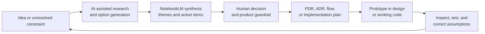
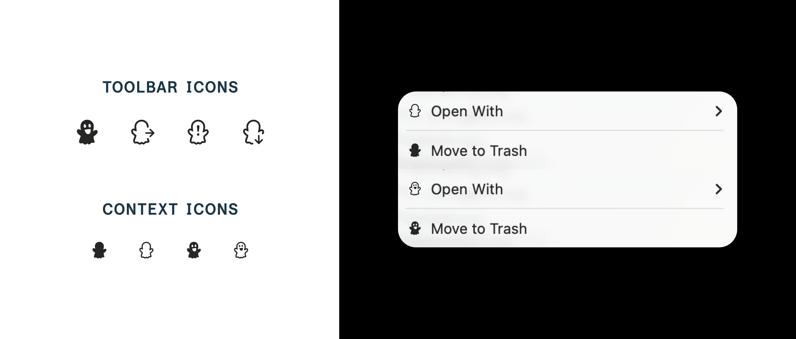
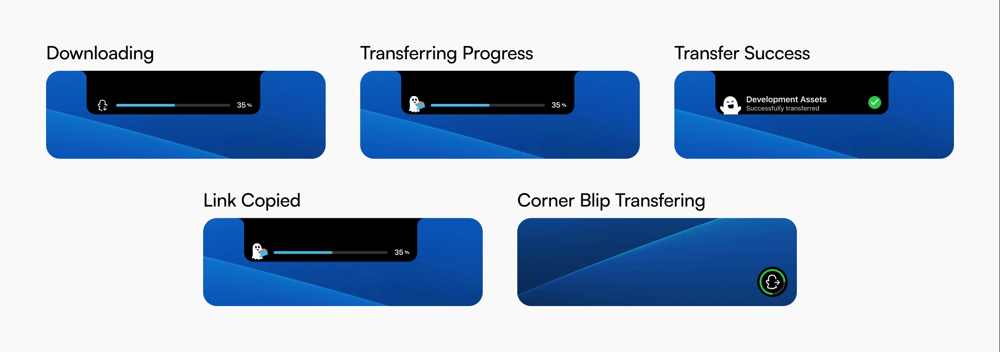
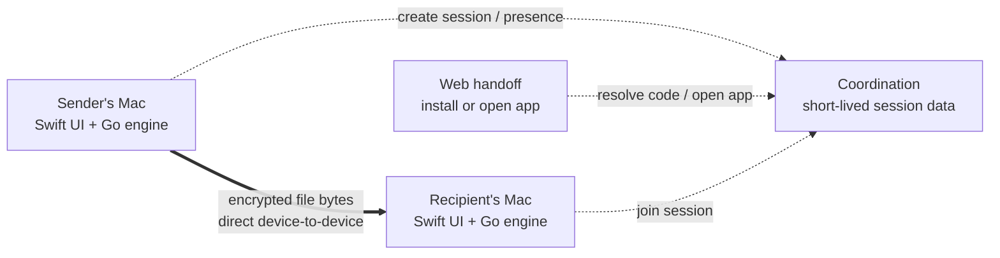

# LinkaBoo

[](<docs/portfolio/Hero Animation.mp4>)

*The hero animation plays inline. [Open the higher-quality MP4.](<docs/portfolio/Hero Animation.mp4>)*

**The app that makes sending files feel as natural as handing them to someone beside you.**

LinkaBoo is a native macOS menu bar app for direct, encrypted, app-to-app file transfer. A sender drops in a file, LinkaBoo copies a one-time handoff link, and the recipient opens that link in the native app. The backend coordinates the introduction; it never becomes a file host.

This repository is both a working MVP and a product case study. It follows the project through a complete product cycle, including problem framing, research, synthesis, requirements, naming, branding, interaction prototyping, architecture, and implementation. It also documents how AI supported each stage, where it accelerated the process, and where human judgment was needed to refine or correct its output.

> **Project status:** active MVP prototype. The native sender/receiver loop, deep-link handoff, transfer progress, history, settings, and branded states are implemented. Reliability and edge-case QA are still in progress.

## At a glance

| | |
| --- | --- |
| **Platform** | macOS 12+ |
| **Product shape** | Native menu bar app + Finder extension + web install/open handoff |
| **Transfer model** | App-to-app product experience with a direct, encrypted P2P data path |
| **Infrastructure stance** | Coordination only; no payload storage and no hidden relay in the MVP |
| **Core technologies** | Swift, AppKit, SwiftUI, Go, Magic Wormhole protocol, XcodeGen |
| **AI-assisted workflow** | ChatGPT/GPT for research, PDRs, naming, messaging, critique, and planning; Google NotebookLM for research synthesis; Midjourney and generative tools for visual exploration; Codex for repository-aware implementation and validation |
| **Long-term direction** | Trusted contacts, automatic device-to-device delivery, and opt-in folder sharing/sync |
| **Collaborator** | [Aaron Price](https://github.com/aaronprice00) — engineering partnership across the Go transfer layer and native macOS implementation |

## 1. The problem and why I started building LinkaBoo

LinkaBoo came from a small frustration I kept running into. I wanted to give someone a file or folder, but first I had to upload it somewhere else. Wait for the upload, create a share link, check its permissions, paste it into email or Slack, then wait for the other person to download it so I could clear the larger files out of paid storage. Every step added distance between me and the person I was sending to, and every transfer left another hosted copy behind.

That workflow wasn't a good experience. What should have felt like "send this file to that person" had become "upload this file to a third party so that person can download it again." The extra copy wasted my time, multiplied my subscriptions, and failed my clients too: downloads blocked by share settings that were too complicated, files that had to be uploaded twice, or transfers that depended on whatever service the client happened to host. All that friction, all that infrastructure, just to move a file between two computers that could already connect to each other.

LinkaBoo started with a narrower question:

> What if sharing a file on felt immediate and personal, while the product stayed out of the path of the file itself?

The goal is not to replace cloud storage. It is to create a better tool for the moment when storage is not the job: both people are available, the sender still has the original, and the file only needs to travel from one device to another.

That question led to three product constraints that shaped everything else:

1. **Keep the sender flow short.** Drag a file onto Boo, get a link, share it.
2. **Make the transfer model honest.** Both native apps participate in a live transfer; the browser is a handoff, not a disguised download client.
3. **Protect privacy and the business model together.** If LinkaBoo never stores or relays payload bytes, infrastructure remains small and users keep control of their data.

## 2. The working process: AI in the loop

LinkaBoo was not generated from one prompt. AI was used across many small loops: ask a question, expand the option space, check the answer against technical reality, capture a decision, prototype it, and feed the result back into the next round.

The starting point was modest: an early Swift drag-and-drop experiment and a test of the Magic Wormhole protocol. The product did not yet have a stable name, a clear receiver experience, a complete state model, or a settled answer to the largest architecture question: what should happen when a direct connection fails?

The working process became:



AI accelerated divergence and documentation; product judgment supplied the boundaries. That distinction became especially important when an answer sounded plausible but contradicted the product's cost model or the behavior of the code. The sections that follow walk the project in cycle order, and each one notes where AI did the heavy lifting and where it needed correction.

## 3. The problem space and the protocol landscape

GPT was used to investigate the moving parts behind "send a file directly": encryption, key exchange, rendezvous, NAT traversal, relay behavior, browser constraints, large-file handling, native platform integration, and the difference between a transfer protocol and a messaging protocol.

Early research compared Signal Protocol, Magic Wormhole, WebRTC, QUIC, TURN, and selected BitTorrent ideas such as chunking, verification, and resume. That work was useful even when the first conclusions were wrong. One early thread confused Signal with the protocol already in the prototype; another described Wormhole too broadly as relay-based. Follow-up questions and inspection of the actual `wormhole-william` implementation corrected the model: LinkaBoo was using Magic Wormhole, and its rendezvous, key exchange, and transit responsibilities needed to be evaluated separately.

The research surfaced a central tension:

| Reliability choice | User benefit | Product consequence |
| --- | --- | --- |
| Direct connection only | Private, fast, no LinkaBoo payload bandwidth | Some restrictive networks will fail |
| Invisible relay fallback | More transfers complete | LinkaBoo becomes responsible for payload bandwidth |
| Hosted browser download | Receiver convenience and asynchronous access | LinkaBoo becomes a storage/delivery service |

The final MVP decision was intentionally not the most universally reliable option. Direct-only transfer preserves the product's reason for existing and makes limitations visible rather than hiding a different business model behind a seamless interface.

### Synthesizing the research with Google NotebookLM

The protocol research, competitive notes, conversation exports, UX questions, and evolving development documents created too much context to hold in one linear thread. Google NotebookLM notebooks were used as a synthesis layer: collect the material, compare repeated themes and contradictions, ask focused questions across the source set, and turn the answers into actionable items.

The useful outputs were not generic summaries. The notebooks helped surface decisions that could change the build:

- native desktop integration was a stronger differentiator than shared UI code
- the browser should hand off to the app instead of becoming a second transfer runtime
- Signal-style security was not the same requirement as secure file transit
- relays, TURN, and stored downloads were operating-cost decisions, not implementation details
- sender presence, receiver readiness, and direct-connection failure needed explicit product states
- Swift/AppKit/SwiftUI plus a shared Go engine fit the actual product better than an iOS-first or React Native-first architecture

Those findings were then rewritten as repository constraints and architecture decision records so the synthesis could influence development instead of disappearing into research notes.

## 4. Defining the Product Through PDRs, Documentation, Guardrails, and setting Clear Boundaries

### Framing the promise

The first definition step was deciding what LinkaBoo would *not* become: no cloud storage product, no browser download flow in v1, no invisible relay, and no account system added simply because file-sharing products usually have one.

Part of that framing was getting precise about two terms the product depends on, because they describe different parts of the system:

| | **What it describes** | **What it means in LinkaBoo** |
| --- | --- | --- |
| **Peer-to-peer (P2P)** | The network path used by the file data | After coordination, the sender and receiver attempt a direct encrypted connection. File bytes move between their devices instead of being uploaded to LinkaBoo storage. |
| **App-to-app** | The product boundary at each endpoint | Both participants use the native LinkaBoo app. The browser link opens the app or explains how to install it; the browser is not a download client in the MVP. |

P2P answers **"where do the bytes travel?"** App-to-app answers **"what software participates?"** A product can be app-to-app while still relaying every byte through its own servers, and a browser can participate in some forms of P2P. LinkaBoo deliberately combines a native app at both ends with a direct device-to-device data path.

Requiring the native app is a product decision, not a technical accident. It gives LinkaBoo a reliable place to work with local files and folders, maintain a live transfer, integrate with Finder and the menu bar, show system-level progress, and attempt the direct TCP connection used by the current engine. The web page can stay small and honest: it coordinates the handoff, but it does not pretend that a file has been uploaded and is waiting there.

### Turning discussion into PDRs and buildable requirements

GPT helped turn rough UX conversations into Product Design Requirements (PDRs), MVP outlines, screen inventories, state machines, acceptance criteria, QA checklists, and Codex-ready development briefs. This was particularly valuable for finding the invisible parts of the experience: invalid links, sender unavailable, connection negotiation, cancellation, destination choice, moved or deleted files, clipboard failure, and the difference between "waiting" and "transferring."

The documents became progressively stricter as the product direction sharpened:

1. broad explorations considered browser downloads, mobile support, identity, contacts, snapshots, and relay fallback
2. a lightweight PDR connected user flows to system states and highlighted where UI concepts were promising behavior the architecture could not yet provide
3. the MVP outline separated recent transfer activity from cloud-like file management
4. the state model defined sender, receiver, and share-session lifecycles
5. ADRs locked Mac-first, native-required, browser-handoff-only, and no-relay decisions
6. the implementation plan translated those decisions into the Go engine, native app, web handoff, and QA workstreams

This documentation did more than organize the work. It gave AI coding tools a bounded context. Codex could inspect the repository and help implement within an explicit product contract instead of optimizing toward familiar but incorrect file-sharing patterns.

## 5. Naming and messaging

Naming moved through several stages, with GPT as a generator and critic at each one. The early working name, **Portal**, described the mechanism but was broad and visually pulled the brand toward vortex imagery. **SendLoop** made the transfer action clearer but felt generic. **LinkaBoo** connected three ideas at once: creating a link, linking one person to another, and the `.boo` domain/ghost character.

GPT was used to generate and critique candidates, pressure-test pronunciation and memorability, explore how the name could behave in a wordmark, and refine the story around the mascot. The final choice was still human: LinkaBoo created the most ownable bridge between product behavior and personality.


*The identity was tested as a mascot-led badge, an integrated wordmark, and a flexible horizontal lockup before the final system was selected.*

Messaging evolved alongside the architecture. Early screens and motion studies used "upload" and "download," familiar words that accidentally implied server storage. Once the direct-only model was explicit, the vocabulary changed to **send**, **receive**, **transfer**, **open in LinkaBoo**, and **waiting for sender**. AI-assisted copy exploration helped make the technical boundary understandable without forcing users to learn the networking model.

## 6. Brand: exploring the identity with Midjourney and generative tools

Generative image tools—including Midjourney explorations—were used to move quickly through visual directions before committing production design time. The work ranged from the Portal vortex and mid-century wordmark prompts to ghost-and-chain metaphors, paperclip forms, character sheets, facial expressions, arms, document props, status icons, office-document illustrations, and color palettes.


The output was treated as a sketchbook, not a final asset pipeline. AI images were useful for answering directional questions:


- should the identity feel technical, magical, or character-led?
- can the mascot remain legible at menu bar size?
- which expressions communicate waiting, effort, success, or failure?
- how can file and folder objects share Boo's visual language?
- where does playful motion support trust, and where does it distract?

Selected ideas were then simplified, redrawn, tested at native UI sizes, and organized into a more controlled system. That refinement led to the horizontal LinkaBoo lockup, the recognizable white ghost silhouette, the electric-blue field, dark navy details, yellow accent, and the filled/outlined variants now used across the app.

### Designing Boo as part of the interface


Boo began as a way to make a technical utility feel approachable, but the character became more useful when treated as interface language rather than decoration.


The silhouette remains recognizable at menu bar scale. Expression, pose, and props then communicate state: idle, ready, carrying a file, transferring, attention required, and complete. This gives LinkaBoo a warmer voice without replacing familiar macOS conventions.



The visual system is deliberately compact:

- electric blue creates a strong, memorable field around a small white character
- dark navy facial details retain contrast at tiny sizes
- a yellow accent adds warmth and gives success/joy moments a signature
- file and folder props explain the product without relying on paragraphs of copy
- filled and outlined variants support toolbar, status, Finder, and contextual uses

character-exploration.png


## 7. Interaction design and prototyping

The design process moved back and forth between identity and interaction rather than treating branding as a final skin. Character explorations tested facial expressions, arms, shadows, and file props at different levels of detail; the successful direction was the simplest one, a friendly ghost with a bold silhouette that could survive reduction to a toolbar glyph.

### The intended experience

The primary interaction lives where Mac users already work: Finder and the menu bar. It also transforms the physical notch found on modern MacBooks into a seamless part of the digital experience.

1. The sender drags a file or folder, prompting the notch to expand into a drop target. On Macs without a physical notch, the interface appears to emerge naturally from the top edge of the screen.
2. The local Go engine creates a one-time transfer code.
3. LinkaBoo turns that code into a branded handoff link and copies it automatically.
4. The recipient opens the link, which launches LinkaBoo through a `linkaboo://` deep link or explains that the app is required.
5. The two apps negotiate an encrypted transfer directly.
6. Both people see progress, success, cancellation, or failure as explicit native states.

There is intentionally no "uploading to LinkaBoo" step. If a direct connection cannot be completed, the product should explain the failure instead of silently routing the file through paid relay infrastructure.

### A native interaction model

Early prototypes centered on drag-and-drop, the menu bar, Finder context actions, and deep links. That kept the experience close to the file instead of asking users to manage another full-sized app window. AI-assisted interaction prompts and critique shaped the top-center notch-style drop target that became the signature entry point.

[](docs/portfolio/compact-interaction.mp4)

*Animation plays inline. [Open the higher-quality MP4 (10 seconds).](docs/portfolio/compact-interaction.mp4)*

This early motion prototype explores how Boo can transform a passive part of the screen into an inviting drag target. The interaction intentionally makes use of the MacBook’s physical notch, turning an otherwise unused and easily ignored area into a functional part of the file-transfer experience. Because the notch is globally visible across the system, it creates a consistent destination that users can access without opening another window or leaving their current task.

Boo notices the cursor, presents a document, accepts the drop, and carries the file into the transfer flow. On Macs without a physical notch, the interface appears to emerge naturally from the top edge of the screen. The prototype’s “Upload Documents” label reflects an earlier stage of the concept. As the architecture became direct-only, the product language evolved toward **send** and **transfer** so the interface would not imply that LinkaBoo stores files in the cloud.

### Prototyping visible transfer feedback

Boo notices the cursor, presents a document, accepts the drop, and carries the file into the transfer flow. On Macs without a physical notch, the interface appears to emerge naturally from the top edge of the screen.




Notch and corner treatments explored how active transfers could remain visible without interrupting the user’s work. Progress, link-copied, success, and error states were designed as a connected system rather than isolated notifications. The revised concepts compare the larger notch interaction with a compact corner “blip,” making the tradeoff between visibility and interruption explicit.

The prototype’s “Upload Documents” label reflects an earlier stage of the concept. As the architecture became direct-only, the product language evolved toward **send** and **transfer** so the interface would not imply that LinkaBoo stores files in the cloud.

### Notification and motion studies


The notification illustrations extend the same state language into moments when the popover is closed. They are intentionally more expressive than the smallest toolbar icons while preserving Boo's core silhouette. Boo can celebrate, carry the transfer, or frame familiar file and folder objects without asking the user to learn a new visual vocabulary.


*Testing the illustrations inside real macOS notifications helped compare familiar document and folder imagery with more expressive Boo-led states.*

Motion studies focused on hovering, anticipation, carrying, and delivery. The goal is not animation for its own sake; movement should confirm that a file has been accepted, indicate activity during an uncertain network step, or make completion feel clear. The compact UI prototype above explores interaction choreography; the character animation below explores personality and physicality at a larger scale.

Google Flow was used during animation ideation to explore staging, timing, camera movement, and how Boo might react to files entering and leaving the interface. These generated studies made it possible to compare motion concepts quickly before deciding which behaviors should be simplified and rebuilt for the native product. Flow functioned as a motion sketchbook rather than a source of production-ready UI animation.

[](docs/portfolio/ai-motion-experiment.mp4)

*Animation plays inline. [Open the higher-quality MP4 (10 seconds).](docs/portfolio/ai-motion-experiment.mp4)*

The AI-assisted exploration was used as a divergent concept study rather than production UI. It helped test how Boo might notice, catch, carry, and release file objects with weight and personality. Those ideas can inform hand-authored motion, while the shipping interface remains flatter, more controlled, and more legible at native UI sizes.

## 8. Technical architecture

LinkaBoo separates product responsibilities so that convenience features cannot accidentally turn the service into a file host.

### Why Magic Wormhole

The transfer engine is built in Go on [`wormhole-william`](https://github.com/psanford/wormhole-william), an implementation of the open [Magic Wormhole](https://github.com/magic-wormhole/magic-wormhole) protocol. Magic Wormhole was a useful starting point because it already solves the difficult introduction problem: how two devices can use a short, single-use code to find one another and establish shared cryptographic keys without asking a person to exchange a long key or create an account.

At a high level, the flow is:

1. The sender creates a short, one-time Wormhole code.
2. Both apps connect to the same mailbox—historically called the rendezvous server—and use the code to enter the same session.
3. The clients perform a password-authenticated key exchange (PAKE, using SPAKE2 in Magic Wormhole) to establish a shared secret. The short code is part of a cryptographic exchange; it is not simply a public file identifier.
4. Over that encrypted control channel, the apps exchange connection "hints" that describe ways to reach each other.
5. The transit layer attempts to establish a direct TCP connection between the two devices.
6. When that succeeds, file data crosses the encrypted connection directly from the sender app to the receiver app.

The mailbox helps the peers meet, but it is not the file path. Magic Wormhole's own documentation separates these responsibilities into a [mailbox protocol](https://magic-wormhole.readthedocs.io/en/latest/ecosystem.html) for the initial exchange and a [transit protocol](https://magic-wormhole.readthedocs.io/en/latest/transit.html) for the encrypted data stream.

This foundation fit LinkaBoo for several reasons:

- short one-time codes support a share-link experience without requiring accounts
- PAKE turns a human-sized code into an authenticated encrypted session
- the coordination channel and bulk-data channel are separate
- the protocol already supports file and directory transfer semantics
- using an established open protocol avoids inventing custom cryptography for the MVP

### The direct-only difference

Standard Magic Wormhole is **direct-preferred**, not strictly direct-only. Its transit protocol normally tries a direct connection first and can fall back to a transit relay when network conditions prevent the peers from reaching each other. The relay still carries encrypted data, but it carries the data nonetheless.

LinkaBoo makes a narrower MVP choice. Direct-only mode is the default, the Go client removes the default transit relay address, and production configuration requires an explicit rendezvous URL. If the peers cannot establish a direct path, LinkaBoo reports the failure instead of silently putting the file onto relay infrastructure.

That decision has a real tradeoff: some transfers will fail on restrictive networks that a relayed product could support. For this phase, that honest limitation protects the original idea—no hosted copy, no payload bandwidth bill, and no gradual drift from a lightweight coordination service into a storage or delivery platform. Relay support would be a business-model decision, not a hidden reliability patch.



### Native macOS layer

- AppKit manages the menu bar item, non-activating panels, drag target, clipboard HUD, and settings window.
- SwiftUI renders transfer history, row-level states, settings, and test views.
- A Finder extension provides a file-adjacent entry point.
- Custom URL handling receives `linkaboo://receive/<code>` handoffs.
- Transfer history is persisted locally at `~/Library/Application Support/LinkaBoo/history.json` and trimmed to 200 records.

### Local Go engine

- wraps `wormhole-william` and the Magic Wormhole file-transfer flow
- creates and joins one-time transfer codes
- handles files and directories
- emits structured JSON progress and error events to the native app
- supports cancellation and configurable destinations
- defaults to direct-only transit by clearing relay configuration

### Coordination and web layers

The intended production backend stores short-lived coordination state only: session creation, sender presence, link resolution, recipient-open events, negotiation payloads, expiry, and cancellation. The web page is an install/open/status handoff. It never receives the file.

This boundary is both a privacy decision and a cost decision: domains, static hosting, and lightweight coordination are predictable; file storage and relay bandwidth change the economics of the product.

## 9. Implementation: connecting design intent to working code

AI also helped connect design intent to development. Interaction prompts and critique shaped the top-center notch-style drop target; PDR states became structured engine events; naming and messaging changes reached the web handoff; and repository-aware coding work with Codex connected the Go process to native Swift UI—inside the product contract the PDRs and ADRs had already established.

The implementation now reflects the process in concrete ways:

- AppKit owns the menu bar, non-activating panels, clipboard HUD, Finder-adjacent behavior, and window lifecycle
- SwiftUI renders history, settings, status rows, and compact content states
- the Go engine creates/joins one-time codes, sends files and directories, reports progress, and defaults to direct-only transit
- JSON line events keep UI state tied to real transfer activity
- XcodeGen makes the native project reproducible
- the static web page explains the native requirement and opens `linkaboo://` rather than handling payload bytes

### Design states meet real engine events

The native interface consumes structured events from the Go process for waiting, negotiation, transfer progress, completion, cancellation, and failure. Recent work replaced a single transient popover state with a persistent transfer history, so UI state now represents the lifecycle of each transfer rather than only the latest event.

Building the real app exposed questions that static mockups could not: how long a copied-link confirmation should remain visible, what belongs in a compact popover versus Settings, what happens when a received file is later moved, and how a failed direct connection should be explained without breaking the product promise.


*The toolbar study connects compact menu bar states with a lightweight history panel for completed, active, failed, and missing transfers.*

### What AI got wrong—and why that improved the process

The conversation archive includes recommendations that are no longer part of LinkaBoo: iOS-first planning, browser receiving, encrypted server uploads, WebRTC plus invisible Wormhole fallback, relay-assisted delivery, email identity, and cloud-like asynchronous links. Preserving those branches matters because they show the role AI actually played.

AI was strongest at expanding possibilities, structuring ambiguity, identifying questions, and translating decisions into artifacts. It was weakest when it filled missing facts with familiar architecture patterns. The response was not to remove AI from the process, but to add stronger controls:

- inspect the code before accepting claims about the current implementation
- separate protocol facts from product recommendations
- use cost as an architecture constraint
- record decisions in ADRs and repository guidance
- label future phases so they cannot drift into MVP scope
- prefer a visible limitation over a hidden contradiction

AI made the process faster and broader, while verification, taste, and product judgment made it coherent.

## 10. Where the MVP stands

### What is working now

- native macOS menu bar app and Finder extension
- drag-and-drop file/folder sending
- one-time codes and branded handoff links
- automatic link copy with a dismissible menu bar HUD
- `linkaboo://receive/<code>` deep-link receiving
- progress events and visible completion/failure states
- persistent transfer history with per-row status
- reveal completed transfers in Finder
- cancellation plumbing
- settings for receive location, logs, about information, and quit
- branded browser handoff page
- development CLI for send/receive testing

### QA still in progress

The latest implementation pass added the link-copied HUD, persistent history, row-level transfer states, and a dedicated Settings window. The happy-path file and folder flows have been exercised; the following checks remain open:

- verify "File Missing" after a completed file is deleted or moved
- verify cancellation from an in-progress history row
- exercise network and invalid-code failures and confirm useful error detail
- verify history restoration after quit and relaunch
- complete Settings persistence and Open Logs checks
- complete end-to-end receiving through a `linkaboo://` deep link
- Complete the full UI and visual design implementation. The initial prototype intentionally prioritized technical feasibility and early user testing before applying the complete design system.

### Product and engineering decisions ahead

- define overwrite/rename behavior when the destination filename already exists
- stress-test very large transfers and decide whether limits or warnings are needed
- expand coverage for directories and multi-file transfers
- harden direct connection negotiation, retries, and recovery
- replace the development rendezvous dependency with LinkaBoo-owned coordination
- polish sender flow, accessibility, instrumentation, packaging, and distribution

The product guardrails remain fixed while this work continues: macOS first, native required, no server-side file storage, no TURN/relay bandwidth, and visible failure instead of a hidden infrastructure fallback.

## 11. Beyond the MVP
The current MVP is intentionally focused on proving the smallest complete behavior: one person chooses a file, another person joins the live session, and the two native apps complete a direct transfer. The link and one-time code provide a practical starting point, but they are not necessarily the final form of the product.

The following opportunities emerged during the design process, but they remain untested hypotheses rather than committed roadmap features:

**Trusted contacts:** Pair with people or devices once, then select a known recipient instead of manually sharing a new link each time.

**Automatic delivery:** Queue a transfer locally and begin when an authorized recipient comes online, with clear controls and visible status at both ends.

**Device-to-device workflows:** Move files between a person’s own Macs as naturally as sending to another contact.

**Shared folders:** Allow specific folders to be shared or synchronized directly between trusted machines.

**Ongoing sync:** Detect changes, transfer only what is needed, and clearly surface conflicts, history, and failures.

These ideas have not yet been validated with real users and should not be treated as promised features. The MVP creates a foundation for testing the core transfer experience first. Observed behavior, user interviews, support requests, usability testing, and broader product validation will determine which opportunities solve meaningful problems and deserve further investment.

Any selected feature would require additional work around device identity, permissions, presence, reconnection, change detection, conflict resolution, and recovery. These capabilities could extend the coordination layer without changing LinkaBoo’s central file-ownership principle.

In the intended model, “automatic” would not mean uploading files to LinkaBoo while another person is offline. Pending data would remain on the sender’s device until authorized machines are available to connect. Likewise, shared folders would represent direct relationships between participating devices rather than a cloud drive hosted by LinkaBoo.

If user research eventually demonstrates a meaningful need for stored or relayed payloads, that functionality would be evaluated as a separate product and business-model decision. It would not be introduced quietly as a technical fallback.

## Developer guide

Technical reference for building and working on LinkaBoo.

### Toolchain

- macOS 12+
- Go 1.24+
- Xcode 16+
- [Task](https://taskfile.dev) — task runner for all build/test commands
- [XcodeGen](https://github.com/yonaskolb/XcodeGen) — generates the native Xcode project from configuration

### Building and testing

The Go engine builds independently of the native app and includes a development CLI for exercising send/receive without the UI:

```bash
task go:build

./build/linkaboo send ~/Documents/report.pdf
./build/linkaboo receive 7-crossword-clockwork --dest ~/Downloads
```

Native app and other project workflows:

```bash
task swift:run        # generate, build, and run the native app
task swift:generate   # regenerate the Xcode project via XcodeGen
task swift:build      # build the native app
task go:test          # run Go engine tests
task web:dev          # serve the web handoff page locally
```

### Transport configuration

The engine's transport behavior is controlled through environment variables:

```bash
LINKABOO_ENV=development|production
LINKABOO_RENDEZVOUS_URL=ws://...
LINKABOO_LINK_BASE_URL=https://linkaboo.app/r
LINKABOO_ALLOW_RELAY=0
LINKABOO_TRANSIT_RELAY_ADDRESS=host:port   # only when relay is explicitly enabled
LINKABOO_APP_ID=app.linkaboo/transfer
```

Development can fall back to the public Magic Wormhole rendezvous service when no rendezvous URL is supplied. That is a prototyping convenience, not the intended production dependency.

### Repository map

```text
cmd/linkaboo/       CLI entry point
internal/engine/    Go transfer engine, configuration, progress, and tests
macos/              Native app, Finder extension, resources, and XcodeGen config
web/                Install/open handoff page
docs/               Architecture decisions, product constraints, and design assets
docs/project-memory/ Verbatim research chats, source index, and project synthesis
```

Deeper technical notes are available in [`docs/architecture.md`](docs/architecture.md), [`docs/state-model.md`](docs/state-model.md), [`docs/backend-contract.md`](docs/backend-contract.md), and [`docs/cost-thesis.md`](docs/cost-thesis.md). The AI-assisted research record is preserved in [`docs/project-memory/README.md`](docs/project-memory/README.md), with the current throughline summarized in [`docs/project-memory/SYNTHESIS.md`](docs/project-memory/SYNTHESIS.md).

## Collaboration

LinkaBoo is led by Caleb Stauss, spanning the entire product cycle, from idea and strategy through brand, illustration, UX/UI, interaction prototyping, development, and technical architecture.

Aaron Price was an engineering collaborator on this project, working closely with me and contributing substantially to the Go transfer engine.

The collaboration has been intentionally cross-disciplinary: product constraints shaped the architecture, implementation constraints reshaped the interface, and the character system evolved alongside real application states.

---

This public repository is a clean project snapshot prepared as a portfolio case study. It includes the current source and project documentation without the private repository's pull-request history.
