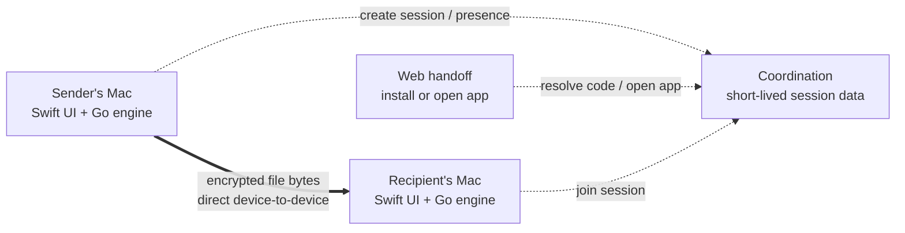

# LinkaBoo


**A Mac-first experiment in making private, peer-to-peer file transfer feel as natural as handing something to the person beside you.**

LinkaBoo is a native macOS menu bar app for direct, encrypted, app-to-app file transfer. A sender drops in a file, LinkaBoo copies a one-time handoff link, and the recipient opens that link in the native app. The backend coordinates the introduction; it never becomes a file host.

This repository is both a working MVP and a product case study: it documents the decisions behind the interaction model, character-led visual system, direct-only architecture, and current engineering work.

> **Project status:** active MVP prototype. The native sender/receiver loop, deep-link handoff, transfer progress, history, settings, and branded states are implemented. Reliability and edge-case QA are still in progress.

## At a glance

| | |
| --- | --- |
| **Platform** | macOS 12+ |
| **Product shape** | Native menu bar app + Finder extension + web install/open handoff |
| **Transfer model** | Encrypted peer-to-peer, app to app |
| **Infrastructure stance** | Coordination only; no payload storage and no hidden relay in the MVP |
| **Core technologies** | Swift, AppKit, SwiftUI, Go, Magic Wormhole protocol, XcodeGen |
| **My focus** | Product direction, concept, brand identity, illustration, UX/UI, prototyping, and product documentation |
| **Engineering collaborator** | [Aaron Price](https://github.com/aaronprice00) — engineering partnership across the Go transfer layer and native macOS implementation |

## The opportunity

Most file-sharing products quietly turn a simple person-to-person exchange into a storage workflow: upload a file, wait for a server, generate a hosted download, and make the receiver trust another cloud destination.

LinkaBoo started with a narrower question:

> What if sharing a file on a Mac felt immediate and personal, while the product stayed out of the path of the file itself?

That question led to three product constraints that shaped everything else:

1. **Keep the sender flow short.** Drag a file onto Boo, get a link, share it.
2. **Make the transfer model honest.** Both native apps participate in a live transfer; the browser is a handoff, not a disguised download client.
3. **Protect privacy and the business model together.** If LinkaBoo never stores or relays payload bytes, infrastructure remains small and users keep control of their data.

## The experience

The primary interaction lives where Mac users already work: Finder and the menu bar.

1. The sender drags a file or folder onto the Boo menu bar target or starts from Finder.
2. The local Go engine creates a one-time transfer code.
3. LinkaBoo turns that code into a branded handoff link and copies it automatically.
4. The recipient opens the link, which launches LinkaBoo through a `linkaboo://` deep link or explains that the app is required.
5. The two apps negotiate an encrypted transfer directly.
6. Both people see progress, success, cancellation, or failure as explicit native states.

There is intentionally no “uploading to LinkaBoo” step. If a direct connection cannot be completed, the product should explain the failure instead of silently routing the file through paid relay infrastructure.


## Designing Boo as part of the interface


Boo began as a way to make a technical utility feel approachable, but the character became more useful when treated as interface language rather than decoration.

The silhouette remains recognizable at menu bar scale. Expression, pose, and props then communicate state: idle, ready, carrying a file, transferring, attention required, and complete. This gives LinkaBoo a warmer voice without replacing familiar macOS conventions.

The visual system is deliberately compact:

- electric blue creates a strong, memorable field around a small white character
- dark navy facial details retain contrast at tiny sizes
- a yellow accent adds warmth and gives success/joy moments a signature
- file and folder props explain the product without relying on paragraphs of copy
- filled and outlined variants support toolbar, status, Finder, and contextual uses


## From brand exploration to product states

The process moved back and forth between identity and interaction rather than treating branding as a final skin.

### 1. Frame the promise

The first step was defining what LinkaBoo would *not* become: no cloud storage product, no browser download flow in v1, no invisible relay, and no account system added simply because file-sharing products usually have one.

### 2. Establish a native interaction model

Early prototypes centered on drag-and-drop, the menu bar, Finder context actions, and deep links. That kept the experience close to the file instead of asking users to manage another full-sized app window.

### 3. Build a character system around state

Character explorations tested facial expressions, arms, shadows, and file props at different levels of detail. The successful direction was the simplest one: a friendly ghost with a bold silhouette that could survive reduction to a toolbar glyph.

### 4. Prototype visible transfer feedback

Notch and corner treatments explored where a live transfer could remain glanceable without interrupting work. Progress, link-copied, success, and error states were designed as a family rather than isolated notifications.


### 5. Connect design states to real engine events

The native interface consumes structured events from the Go process for waiting, negotiation, transfer progress, completion, cancellation, and failure. Recent work replaced a single transient popover state with a persistent transfer history, so UI state now represents the lifecycle of each transfer rather than only the latest event.

### 6. Refine through implementation

Building the real app exposed questions that static mockups could not: how long a copied-link confirmation should remain visible, what belongs in a compact popover versus Settings, what happens when a received file is later moved, and how a failed direct connection should be explained without breaking the product promise.

## Notification and motion studies


The notification illustrations extend the same state language into moments when the popover is closed. They are intentionally more expressive than the smallest toolbar icons while preserving Boo's core silhouette.

Motion studies focused on hovering, anticipation, carrying, and delivery. The goal is not animation for its own sake; movement should confirm that a file has been accepted, indicate activity during an uncertain network step, or make completion feel clear.


The AI-assisted exploration was used as a divergent concept study, then compared with the flatter system used in the product. It helped test personality and dimensionality quickly, while the final interface direction stayed simpler and more legible at native UI sizes.

## Technical architecture

LinkaBoo separates product responsibilities so that convenience features cannot accidentally turn the service into a file host.



### Native macOS layer

- AppKit manages the menu bar item, non-activating panels, drag target, clipboard HUD, and settings window.
- SwiftUI renders transfer history, row-level states, settings, and test views.
- A Finder extension provides a file-adjacent entry point.
- Custom URL handling receives `linkaboo://receive/<code>` handoffs.
- Transfer history is persisted locally at `~/Library/Application Support/LinkaBoo/history.json` and trimmed to 200 records.

### Local Go engine

- wraps the Wormhole-style encrypted transfer experiment
- creates and joins one-time transfer codes
- handles files and directories
- emits structured JSON progress and error events to the native app
- supports cancellation and configurable destinations
- defaults to a direct-only transport stance

### Coordination and web layers

The intended production backend stores short-lived coordination state only: session creation, sender presence, link resolution, recipient-open events, negotiation payloads, expiry, and cancellation. The web page is an install/open/status handoff. It never receives the file.

This boundary is both a privacy decision and a cost decision: domains, static hosting, and lightweight coordination are predictable; file storage and relay bandwidth change the economics of the product.

## What is working now

- native macOS menu bar app and Finder extension
- drag-and-drop file/folder sending
- one-time codes and branded handoff links
- automatic link copy with a dismissible menu bar HUD
- `linkaboo://receive/<code>` deep-link receiving
- progress events and visible completion/failure states
- persistent transfer history with per-row status
- reveal completed transfers in Finder
- cancellation plumbing
- settings for receive location, logs, about information, and quit
- branded browser handoff page
- development CLI for send/receive testing

## Current validation and next steps

The latest implementation pass added the link-copied HUD, persistent history, row-level transfer states, and a dedicated Settings window. The happy-path file and folder flows have been exercised; the following checks and product decisions remain open.

### QA still in progress

- verify “File Missing” after a completed file is deleted or moved
- verify cancellation from an in-progress history row
- exercise network and invalid-code failures and confirm useful error detail
- verify history restoration after quit and relaunch
- complete Settings persistence and Open Logs checks
- complete end-to-end receiving through a `linkaboo://` deep link

### Product and engineering decisions ahead

- define overwrite/rename behavior when the destination filename already exists
- stress-test very large transfers and decide whether limits or warnings are needed
- expand coverage for directories and multi-file transfers
- harden direct connection negotiation, retries, and recovery
- replace the development rendezvous dependency with LinkaBoo-owned coordination
- polish sender flow, accessibility, instrumentation, packaging, and distribution

The product guardrails remain fixed while this work continues: macOS first, native required, no server-side file storage, no TURN/relay bandwidth, and visible failure instead of a hidden infrastructure fallback.

## Run the prototype

### Requirements

- macOS 12+
- Go 1.24+
- Xcode 16+
- [Task](https://taskfile.dev)
- [XcodeGen](https://github.com/yonaskolb/XcodeGen)

### CLI

```bash
task go:build

./build/linkaboo send ~/Documents/report.pdf
./build/linkaboo receive 7-crossword-clockwork --dest ~/Downloads
```

### Native app

```bash
task swift:run
```

Useful project commands:

```bash
task go:test
task swift:generate
task swift:build
task web:dev
```

### Transport configuration

```bash
LINKABOO_ENV=development|production
LINKABOO_RENDEZVOUS_URL=ws://...
LINKABOO_LINK_BASE_URL=https://linkaboo.app/r
LINKABOO_ALLOW_RELAY=0
LINKABOO_TRANSIT_RELAY_ADDRESS=host:port   # only when relay is explicitly enabled
LINKABOO_APP_ID=app.linkaboo/transfer
```

Development can fall back to the public Magic Wormhole rendezvous service when no rendezvous URL is supplied. That is a prototyping convenience, not the intended production dependency.

## Repository map

```text
cmd/linkaboo/       CLI entry point
internal/engine/    Go transfer engine, configuration, progress, and tests
macos/              Native app, Finder extension, resources, and XcodeGen config
web/                Install/open handoff page
docs/               Architecture decisions, product constraints, and design assets
```

Deeper technical notes are available in [`docs/architecture.md`](docs/architecture.md), [`docs/state-model.md`](docs/state-model.md), [`docs/backend-contract.md`](docs/backend-contract.md), and [`docs/cost-thesis.md`](docs/cost-thesis.md).

## Collaboration

LinkaBoo is led by **Caleb Stauss**, spanning the product idea, strategy, brand, illustration, UX/UI, interaction prototyping, and product direction.

**Aaron Price** is credited as the project's engineering collaborator. Aaron helped turn the concept into a working application, contributing substantially to the Go transfer engine, Swift/AppKit integration, deep-link flow, progress and history work, and the technical systems that support the native experience.

The collaboration has been intentionally cross-disciplinary: product constraints shaped the architecture, implementation constraints reshaped the interface, and the character system evolved alongside real application states.

---

This public repository is a clean project snapshot prepared as a portfolio case study. It includes the current source and project documentation without the private repository's pull-request history.
